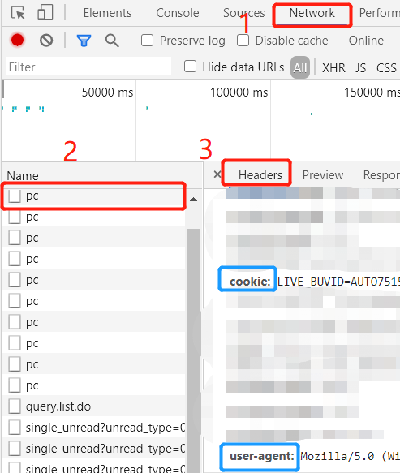
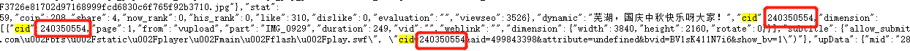

# bilibili_danmu_crawl
 可以爬取b站视频弹幕信息，最后依据任意图片输出词云图。

*** 
代码是修改了一篇找到的博主代码，大家也可以选择查看原博主代码学习~[这里附上链接](https://www.jianshu.com/p/39158eb6836d)

以下过程我也制作成了视频放在我的[b站](https://www.bilibili.com/video/BV1sK411N7i6)上，如果有兴趣的话也可以给up来个一键三连~~~哈哈哈
***
<!-- TOC -->

- [bilibili_danmu_crawl](#bilibili_danmu_crawl)
  - [前期准备](#前期准备)
  - [使用方法](#使用方法)

<!-- /TOC -->
 ## 前期准备
 * python库准备
  
    ```python
    import numpy as np
    from PIL import Image
    from wordcloud import WordCloud, ImageColorGenerator
    import matplotlib.pyplot as plt
    import requests
    import jieba
    from pyquery import PyQuery as pq
    from urllib.parse import urlencode
    import datetime
    ```
- `cookie`、`User-Agent`准备

    打开bilibli网页，按F12打开开发者模式，按如图所示点击可以找到

     
    
* `cid`准备
  
    打开bilibili所要爬取弹幕信息的视频，`ctrl+u`打开源码，`crtl+f`查找cid：
    页面会出现很多cid，你就找到和你视频相关的那一个（我找的就是离我想要的视频标题最近的那个，并且发现出现多次都一样）

    

## 使用方法

在代码中需要填入你的`cookie`（[1]处）和`User-Agent`（[2]处）：

```python
    headers = {
        'Cookie': "需要找到并填入的地方[1]",
        'Host': 'api.bilibili.com',
        'Origin': 'https://www.bilibili.com',
        'User-Agent': "需要找到并填入的地方[2]"
    }
```

```python
img = Image.open('03.png') 
```
这里我放了一张图片，大家可以选择任意想出现弹幕的样式，但注意背景需要是透明的，顺便附上我发现的一个使用简易方便的抠图网页，效果我觉得不辍~[附上地址](http://www.aigei.com/bgremover)

```python
def main():
    base_url = "https://api.bilibili.com/x/v2/dm/history?"
    date_list = "这里填当前日期[3]"
    params = {
        'type': '1',
        'oid': '这里填找到的cid[4]',
        'date': date_list

    }
```
另外这里需要填上你想要爬取的弹幕截止日期[3]。最后填入你找到的`cid`号[4]。
***
基本上就是这样子啦~由于我上传的时候这边虚拟环境已经删掉了，上面的代码之前跑过应该没问题，所以大家要是有问题的话也可以扣我，我会尽快回复啦~

